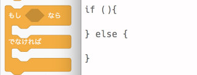

# ピヨグラミング #2

---
## 連絡
- 会場について
    - 飲食・喫煙・トイレ･･･
- 写真撮影について
    - 写真撮影NGな方はお手数ですが、お申し出てください

---
## 今日の流れ

- イントロダクション
- Scratchを使ってみよう
    - 前回の復習
    - 条件判断
    - 繰り返し処理
    - 変数を使う?

---

- Perlでプログラミングしてみよう
    - 前回の復習
    - 条件判断
        - 真偽値
        - if文
    - 繰り返し
        - for
        - while
        - foreach
---

### ピヨグラミングとは?

- プログラミングの初心者を対象とした勉強会です
- 昨年まで開催していた「Perl入学式in沖縄」のスタッフを中心に、 今年から始めました
- 全5回で、受講料は一切かかりません!!!


---
### ピヨグラミングとは?
- この勉強会では「プログラミング」を学ぶ上での基礎的な部分を全5回で行います
    - ピヨグラミングを卒業すると、 他の言語の学習や、 作りたいものをプログラムで表現できやすくなります
- 「プログラミングそのものの入門として、プログラミングの考え方を身に着ける!」のがゴールです
    - その為、特定の言語の機能などにフォーカスした話は極力しません
    - webアプリケーションを作成する上での話も、 プログラミング自体の入門とは脱線していしまうので触れません
        - もちろん皆さんの要望があれば開催します

---

- 恥ずかしい事は無いので、 ガンガン質問してください!!
    - 皆さんから「xxxが勉強したい!!」や、 「ここがよくわからない」などが有れば、 柔軟に内容を変える予定です!
- この勉強会の完走後に、例えば「webプログラミングをしたいからPHPを学びたい!」と思い立った時に
    - なんとなく基本構文がどういうのがあるか知っている
    - どう構築すれば目的のプログラムが書けるか、少しイメージできる
    - 入門書やサイトを見たときに、出てくる用語の7割くらいは見たことがある
- という状態になってもらえるのがゴールです

---

## ピヨグラミングでのプログラミング言語の考え方
- その為、ピヨグラミングでは「皆さんに特定の言語を深く知ってもらう」様なカリキュラムは組んでいません
- もし、今回使うPerlに興味があればOkinawa.pmやYAPCなどのコミュニティ勉強会/カンファレンスに参加してみましょう
- Perlはあくまでプログラミングを学習する道具です。今回の勉強会ではこれを意識して構成していきます
    - その為Perlの深い機能などについては、必要最低限の紹介しか行いません

---

## 勉強会以外でのサポート

- slackというチャットツールでの質問・相談・雑談などが便利です
    - Perlに強いひとが多いですが、Perl以外の言語も大体触っている人が多いのでPHPの質問でも大丈夫です
    - 機械学習はどうなんだろう…
- それ以外の沖縄の勉強会でもスタッフがいることが多いです
    - Okinawa.rb
    - Okinawa.pm
    - tech美られでぃ
    - ぎのわん勉強会

---

## 早速ですが
- なにか質問ありますか?

---

### 自己紹介
- 今回のサポーターの自己紹介です
- その後皆さんで
    - 「名前(アカウント名など)」
    - 「どうしてプログラミングを始めようと思ったか」
    - 「やってみたいこと」
- を話して見ましょう!!


---

## 今日のメインコンテンツについて

- 今日はプログラミングする上で重要な分岐とループといった制御構造を学びます!!!
- 説明するより手を動かしたほうが早いので、早速手を動かしてみましょう


---

# Scratch編

---

## [復習]Scratchとは

- ~~猫を動かせるプログラミング言語~~

---
## [復習]Scratchとは

- ビジュアルプログラミング言語と呼ばれるものです
    - プログラミングの考え方を楽しく学べます
    - プログラミングの練習以外にも、ゲームやグリーティングカードの作成などもできます
- [NHKで厚切りジェイソンが番組をしている](https://www.nhk.or.jp/sougou/programming/)

---
## 練習問題

- 猫を左上から右端に移動させて、そのまま右下に移動させてみましょう
    - ヒント:早すぎてよくわからないときは右上で一旦止めてみましょう
    - ヒント:  「旗が押された時」を上におくと　便利そう

---
## 今日の練習問題

- **挙動不審な猫を作ろう**
    - 左右にキョロキョロ向きを変える猫を作ってみましょう
    - できたら旗がクリックされたらずっとキョロキョロしていたらいいですね

---
## 今日の練習問題

- **挙動不審な猫を作ろう**
    - 左右にキョロキョロ向きを変える猫を作ってみましょう
    - できたら旗がクリックされたらずっとキョロキョロしていたらいいですね
- 挙動不審な猫はビビりやすいです
    - **スペースキーが押されるとびっくりして泣いちゃうような猫**を作ってみましょう

---
## プログラミングとScratch

- 基本的にプログラムは「逐次処理」で実行されます
    - 上から下に順番に実行されていきます
- Scratchだと各ブロックを連結するのが逐次処理に対応しています
- プログラムは主に「式や文」で構成されます
    - 文をかいたらセミコロンをつけます
    - Scratchでは「動き」や「見た目」などが文、「イベント」や「制御」が式に対応しています

---
## Scratchどうでしたか?

- なにか質問があれば遠慮なくお願いします

---

# Perl編

---
## [復習]プログラミングとは?

- 機械(大体パソコン)にしてほしい命令を書くこと
- 機械は機械語(0と1の並び)しかわからないので、人間が普段使う英語や日本語で指示をすることができません
- 01に最終的に変換するけれど、人間がそこそこわかりやすい言語として「プログラミング言語」が開発されました
- プログラミング言語はたくさんあります
    - C, Ruby, Perl, Python, PHP, Go, Haskell, Java, C++, Rust, なでしこ,....
- それぞれ「特性」や「主戦場」が異なります
- プログラミングを初めてするときは、1つの言語である程度まで勉強するのがオススメです
---

## [復習]Perlとは?

- 世界にたくさんあるプログラミング言語の1つ
    - スクリプト言語、LL言語と呼ばれる中の1つです
- 「手続き型」言語ですが、オブジェクト指向などの機能があります
    - あまり触れませんが…
- 今回はそこそこ手軽に使えるプログラミング言語なのでPerlを使っています
- 厳密にはPerl5のことをPerlと読んでいます
    - マスコットはラクダやアルパカです

---

## プログラムでよく使う記号

- `"` ダブルクォート(ダブルクォーテーション)
    - shift押しながら2で入力できます
- `'` シングルクォート(シングルクォーテーション)
    - shift押しながら7で入力できます
- `/` スラッシュ
    - スラッシュ(右下かな)でお願いします
- `\` バックスラッシュ
    - option押しながら円マークで入力可能です
- `;` セミコロン
- `:` コロン
- `,` カンマ
- `.` ドット

---

## [復習]プログラミング言語とデータ

- データをいかに整形して表現するか、というところがあるのでデータを表現しやすくする機能があります
- データの例
    - 計算結果
    - 人の個人情報
    - Twitterのツイート, fav, RT, フォロー...
- これらのデータは主に **「変数」と呼ばれる箱に保存**します

---

## Perlでの変数
- Perlでは変数は実は3種類ありますが、今回は「スカラ変数」と呼ばれるものを使います
- 一般的なプログラムの変数です。
- Perlでは `$変数名` で使います
    - scalar の `$` らしいです[要出典]
- Perlでは変数の宣言(最初に使う時)に `my` と書きます
    - 他の言語では特別宣言の構文がない場合もあります

```perl
my $hoge;
```

---
## Perlでの変数
- プログラミングでは変数の代入に `=` を使います
    - 一般的な数学とは意味がことなり「右辺値を左辺に代入する」という意味です
- 宣言と代入は両方一緒にするのがオススメです

```perl
my $hoge = "hello!"

$hoge = "heyheyhey";
```

---

## ダブルクォーテーションとシングルクォーテーション
- Perlでは文字列を `"` か `'` のどちらかで囲みます
- それぞれ意味が異なります
- `'`
    - 変数や制御文字が展開されず、文字として使われます
- `"`
    - 変数や制御文字が展開されます

---

## print文

- Perlではprint文で文字を出力することが可能です
- 最後に改行を表す制御文字 `\n` をいれるのを忘れずに!


---

## 練習問題

- 変数 `$msg` を宣言し、なにか文を代入してみましょう
- 次の2通りのprintの仕方でどう表示が変わるか見てみましょう

```perl
print '$msg\n';
print "$msg\n";
```

---
## これからPerlを書く上でのお約束

- Perlは歴史的に自由な文法なので、かなりいろいろな書き方ができます
- バグを生みやすい書き方もできてしまうので、あえてPerlに「ちゃんと書きますよ」と教えるのが最近の流行です

```perl
use strict;
use warnings;
```
- プログラムの先頭にプラグマと呼ばれるこの2行を書くことで、現代的に書くという宣言ができます
    - バグの早期発見に役立つので、これからのプログラムはこれを使いましょう

---

## 練習問題

- 2行をいれないでバグを発見してみましょう

```perl
$hoge = "hgello";
print "$hoge\n";
```

---

## 代入演算子

- 基本的に次のようなコードを書くことが多いです

```perl
my $number = 10;
$number = $number + 90;

my $str = "hello";
$str = $str . " world!";
```

---
## 代入演算子

- あまりにも自分に代入する処理が多いので、こういうふうに書くことができます

```perl
my $number = 10;
$number += 10;

my $str = "hello";
$str .= " world!";
```

---
## インクリメント

- また、1を足したり引いたりするのが多いので、こういう書き方もできます

```perl
my $number = 10;
$number++;
```

これは、これと意味が同じです

```perl
my $number = 10;
$number = $number + 1;
```
- 1を足すことをインクリメント, 1を引くことをデクリメントと呼びます
- `++` の記号は前に置くことも可能ですが、いろいろと意味が異なる使い方もできます
    - その為、インクリメントはそれだけで分離し、基本後ろに`++` を書くのが良いとされます

---

## 練習問題

- 代入を使って `$number` にまず0を代入します
- 次に1を加えて
- 次に10をかけて
- 最後に100で割りましょう

---
## 復習お疲れ様でした
- なにか質問ありますか?


---
# 条件分岐

- まず Scratchの「もし〜なら」に対応する条件分岐を見ていきます

---
## 条件分岐

- Scratchではどのようなときに使いましたか?

---
## プログラミングでの条件分岐

- プログラムでは主に「if文」というもので条件を判断させ、分岐させます


---
## 対応付




---

## ループ処理

- Scratchの「ずっと」や「あいだじゅう」に対応する処理を「ループ処理」といいます
    - 日本語的には「繰り返し処理」「反復処理」ですね!

---

## なんでループ処理があるのか

- Scratchでは猫を「ずっと」動かす時などに使いました
- プログラミングでも、「ずっと」同じ処理をしたい場合や、「ある回数」同じ処理をしたい時、「それになるまで」処理をしたい時に使います
    - Scratchで猫を動かすのと考え方は同じですよね!
- もし、ループ処理がないと、例えば「同じ処理を100回したい!」となった時に、100回同じコードを書く必要があります
    - 流石に辛いですよね...!
- またプログラムでよく使われる「集合(配列など)」に対して同じ処理をしたい時にも使います
    - この使い方は後で説明します

---

## ループ処理の種類

- プログラミング言語の大体には大きく2つのループ処理が実装されています
- 他のループ方法も言語によってはありますが、今回は基本を勉強します


---

## ループ処理の種類
- for
    - 指定した回数を繰り返すことができる
    - 集めた要素(集合に対して繰り返す)

- while
    - ある条件を満たしている間、繰り返す

---

## 使い分け

- 回数が決まっている。ある集合に対して同じことをしたい
    - forを使おう!!
- ある一定条件でループさせたい
    - whileを使おう!!!

- 基本的にはこの考え方ですが、強制はないので、好きな方で書きましょう
    - 両方互換性があるので、どちらの書き方でも可能です

- そもそもこれらを使わないという手もあります(今回は触れません)

---

## for文の基本構造

- PerlやC, Javaでのfor文は主に次の構造になっています


```perl
for (カウンタ変数の初期化 ; ループの継続条件; 更新)
for (my $i = 0; $i < 10 ; $i++){
    
}
```

---

## ブロック

- 複数の文(statement)の集合のことをブロックといいます
    - 日本語で言うところの段落に近い概念です
- PerlやC言語では `{` `}` で囲まれている部分がブロックとなります
    - 他の言語では、 インデント(字下げ) や `begin` `end` などで囲むケースがあります
- for文やwhile文では、ループ中に実行する処理をブロックで表現します

---

## for文

- forループは次の手順で実行されます
1. カウンタ変数の初期化などの初期化を実行する (;区切りの一番左)
2. 条件を評価(確認する) falseならループを抜ける
3. ブロックの処理を実行
4. 更新をする
5. また条件評価(2に戻る)

```perl
for (カウンタ変数の初期化 ; ループの継続条件; 更新)
for (my $i = 0; $i < 10 ; $i++){
    
}
```

---

# for文の例

- ループのたびに、集合から1つ1つ文字列を取り出し、 変数 `$animal` に代入します
- その代入した変数を使って、ブロックの中の処理を実行します
- ブロックが終わったら次の値を取り出します
- それを値がなくなるまで繰り返します

```perl
print "start loop!\n";
print "-------\n";

for my $animal ('cat', 'dog', 'bird', 'penguin'){
    print "Hello $animal!\n";
    print "Bye. $animal!\n";
    print "-------\n";
}

print "end loop---!\n";
```

---
```perl
print "start loop!\n";
print "-------\n";

for my $animal ('cat', 'dog', 'bird', 'penguin'){
    print "Hello $animal!\n";
    print "Bye. $animal!\n";
    print "-------\n";
}

print "end loop---!\n";
```

- このプログラムでは `('cat', 'dog', 'bird', 'penguin')` という 文字列の集合をループに利用します
- 集合を作るには、 変数や文字列、数値といったデータ構造を、カンマ `,` で区切りながら、並べます

---

## リスト

```perl
('apple','banana','orrange',500);
```

- このような `()` の中にカンマ区切りで並べられているデータ構造を「リスト」と呼びます
- 次回学習予定の「配列」に代入して使う事が多いです
- リストは順序が決められており、この場合は最初が `apple` です
- リストなどの集合に作用するfor文などを「イテレーター」という呼び方をすることがあります

---

# forの動き

- 図かアニメーションをいれる

---

# Perlで数字の集合を作る

- Perlでは `'数字'..'数字'` と書くことで、 その数値の範囲の集合を作ることができます

- ↓のプログラムを実行して見ましょう!
  
```perl
print 1..10;
print "\n";
```

---

## 練習問題

- Perlを使って 1から20までの数値の集合を作りましょう
- 次に、 -10から10までの集合を作ってみましょう

---

## for文の例

- `..` と組み合わせると、指定した回数を繰り返すことができます
    - ループのたびに、集合から1つ1つ数字を取り出し、 変数 `$i` に代入します
    - その代入した変数を使って、ブロックの中の処理を実行します
    - ブロックが終わったら次の値を取り出します
    - それを値がなくなるまで繰り返します

```perl
for my $i (1..10){
    print "numbers is $i\n";
}
```

- `$i` とは、index(索引)の略で、こういったループ処理や配列の操作(次回以降に学びます)でよく使われます
- 集合の中の1要素を取るときに、数値を `$i` に設定することが慣習的に多いです

---


# インデント

- すでにお気づきかもしれませんが、先程のループのプログラムには、行頭に謎の空白がある行があります

```perl
for my $i (1..10){
    print "numbers is $i\n";
    print "hello\n";
}

print "finish loop!\n";
```

- 上の例では2,3行目に謎の空白が行頭にあります
- この行の様に、行頭に空白をいれることを「インデント」、「インデントする」と呼びます
    - インデントは日本語では「字下げ」と呼びます
- インデントは、プログラムではただの空白なので、特に意味を持ちません

## 綺麗なコードとインデント

- では、なぜインデントをするのでしょうか
- これは、先程のブロックと関連しています


```perl
for my $i (1..10){
print "numbers is $i\n";
print "hello\n";
}

print "finish loop!\n";
```

- 例えば、 上のコードの場合、どこからどこまでが、for文でループの度に実行されるのか `{` と `}` を注意深く探さないといけません


## 綺麗なコードとインデント


```perl
for my $i (1..10){
if ($i % 2 == 0){
print "this is even\n";
}else{
print "numbers is $i\n";
print "hello\n";
}
}

print "finish loop!\n";
```

- さらに中にif文をいれると、「あれ...どこからどこまでがif文の範囲...?」みたいになってしまいます

# 綺麗なコードとインデント


```perl
for my $i (1..10){
if ($i % 2 == 0){
if ($i == 2){
print "this is even and i = 2!!\n";
}else{
print "this is even\n";
}
}else{
print "numbers is $i\n";
print "hello\n";
}
}

print "finish loop!\n";
```

- if文の中にif文をいれるともはやなんだかわかりません... 😇 

# インデントをしよう

- インデントは、半角スペースかtab文字が良いとされています
    - 最近のプログラマの間では、半角スペースがよく利用されています
- インデントでいれる半角スペースの長さは言語によって推奨されているものがある場合があります
    - 他にはプロジェクトベースで指定されています
    - また、半角スペースではなくタブが推奨されているのもあります...(ややこしいですね)

- Perlでは、「4つの半角スペース」をインデントスタイルとして利用するケースが多いです
    - 他の言語では「2つの半角スペース」もしくは「4つの半角スペース」が多いです
- インデントは、自分がプログラミングする上で、理解の助けになるのでつける癖をつけましょう
- 今回は**半角スペース2つ分のインデント**を付けていきましょう

# 綺麗なコードとインデント


```perl
for my $i (1..10) {
  if ($i % 2 == 0) {
    if ($i == 2) {
      print "this is even and i = 2!!\n";
    } else {
      print "this is even\n";
    }
  } else {
    print "numbers is $i\n";
    print "hello\n";
  }
}

print "finish loop!\n";
```

## 次回は...

- 皆さん何かやりたいのありますか?
